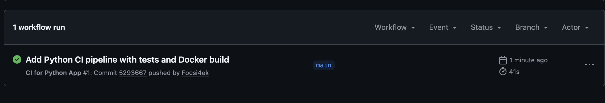
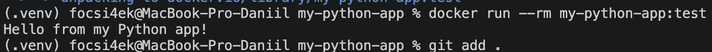

# 🐍 Python CI Pipeline with GitHub Actions

**Автор:** Абрамов Даниил Сергеевич

Учебный проект для изучения **Continuous Integration (CI)** на примере небольшого Python-приложения.

Проект автоматически проверяется при помощи **GitHub Actions**: выполняется линтинг кода, запускаются тесты сразу на нескольких версиях Python, а после успешной проверки собирается Docker-образ приложения.

---

## 🎯 Цель проекта

Основная цель — познакомиться с построением полноценного CI Pipeline для Python-приложения.

В рамках проекта реализованы:

- автоматический запуск CI при push
- запуск CI при Pull Request
- проверка Python-кода через Flake8
- запуск тестов через Pytest
- тестирование на нескольких версиях Python
- установка приложения в development mode
- сборка Docker-образа
- локальная проверка Docker-контейнера

---

## 🛠️ Используемые технологии

| Технология | Назначение |
|---|---|
| 🐍 Python | Основной язык приложения |
| ⚙️ GitHub Actions | Автоматизация CI |
| 🧪 Pytest | Автоматическое тестирование |
| 🔍 Flake8 | Проверка качества Python-кода |
| 🐳 Docker | Контейнеризация приложения |
| 📦 Setuptools | Установка Python-пакета |
| Git | Контроль версий |
| GitHub | Хранение исходного кода |

---

## 📁 Структура проекта

    my-python-app/
    ├── .github/
    │   └── workflows/
    │       └── ci.yml
    │
    ├── myapp/
    │   ├── __init__.py
    │   └── app.py
    │
    ├── tests/
    │   └── test_app.py
    │
    ├── Dockerfile
    ├── requirements.txt
    ├── setup.py
    ├── README.md
    ├── 01-github-actions-success.png
    └── 02-docker-run-success.png

---

# 🐍 Приложение

Основной код находится в:

    myapp/app.py

Приложение содержит простую функцию сложения:

    def add(a: int, b: int) -> int:
        """Возвращает сумму двух чисел."""
        return a + b

А также функцию запуска приложения:

    def main():
        print("Hello from my Python app!")

При локальном запуске:

    python3 myapp/app.py

получаем:

    Hello from my Python app!

---

# 🧪 Автоматические тесты

Для проверки приложения используется **Pytest**.

Тесты находятся в:

    tests/test_app.py

Проверяется работа функции сложения с различными значениями:

    assert add(2, 3) == 5
    assert add(-1, 1) == 0
    assert add(0, 0) == 0

Запуск тестов:

    pytest tests/

При успешном выполнении:

    1 passed

---

# 🔍 Проверка кода с Flake8

В CI Pipeline используется **Flake8**.

Flake8 выполняет автоматическую проверку исходного Python-кода и позволяет обнаруживать:

- синтаксические ошибки
- ошибки импортов
- неопределённые переменные
- нарушения стиля
- проблемы со структурой Python-кода

Основная проверка:

    flake8 . --count --select=E9,F63,F7,F82 --show-source --statistics

Дополнительно выполняется проверка стиля:

    flake8 . --count --exit-zero --max-complexity=10 --max-line-length=127 --statistics

---

# ⚙️ GitHub Actions

Workflow расположен по пути:

    .github/workflows/ci.yml

Pipeline автоматически запускается при:

    push

и:

    pull_request

для веток:

    main
    master

---

# 🔄 CI Pipeline

Общий процесс работы CI выглядит следующим образом:

    Developer
        │
        │ git push
        ▼
    GitHub Repository
        │
        ▼
    GitHub Actions
        │
        ▼
    ┌──────────────────────────┐
    │       Lint & Test        │
    │                          │
    │ Python 3.9               │
    │ Python 3.10              │
    │ Python 3.11              │
    │ Python 3.12              │
    └─────────────┬────────────┘
                  │
                  │ success
                  ▼
    ┌──────────────────────────┐
    │    Build Docker Image    │
    │                          │
    │   my-python-app:test     │
    └─────────────┬────────────┘
                  │
                  ▼
             ✅ Success

---

# 🧩 Matrix Testing

Одна из особенностей Pipeline — использование **Matrix Strategy**.

Приложение автоматически проверяется сразу на четырёх версиях Python:

| Версия |
|---|
| Python 3.9 |
| Python 3.10 |
| Python 3.11 |
| Python 3.12 |

GitHub Actions создаёт отдельный CI job для каждой версии Python.

Это позволяет убедиться, что приложение совместимо сразу с несколькими версиями языка.

---

# 📦 Установка зависимостей

Зависимости находятся в файле:

    requirements.txt

Используются:

    pytest
    flake8

Установка:

    python3 -m pip install -r requirements.txt

---

# 🛠️ Development Mode

Проект содержит файл:

    setup.py

Он позволяет установить приложение как локальный Python-пакет:

    python3 -m pip install -e .

Флаг:

    -e

означает **editable mode**.

Изменения в исходном коде становятся доступны без необходимости каждый раз переустанавливать пакет.

---

# 🐳 Docker

После успешного прохождения тестов GitHub Actions выполняет сборку Docker-образа.

Dockerfile использует официальный образ:

    python:3.11-slim

Схема сборки:

    Python 3.11
        │
        ▼
    Install dependencies
        │
        ▼
    Copy application
        │
        ▼
    Docker Image
        │
        ▼
    my-python-app:test

---

## 🔨 Локальная сборка Docker-образа

В корне проекта:

    docker build -t my-python-app:test .

После успешной сборки можно проверить созданный образ:

    docker images

---

## ▶️ Запуск контейнера

Запуск приложения:

    docker run --rm my-python-app:test

Результат:

    Hello from my Python app!

После завершения работы контейнер автоматически удаляется благодаря параметру:

    --rm

---

## 💻 Запуск Bash внутри контейнера

При необходимости можно открыть терминал внутри контейнера:

    docker run --rm -it my-python-app:test /bin/bash

Это позволяет изучить файловую систему контейнера и установленное окружение.

---

# 🚀 Этапы GitHub Actions

Workflow выполняется в несколько этапов.

### 1. Checkout

GitHub Actions загружает содержимое репозитория:

    actions/checkout@v4

### 2. Setup Python

Устанавливается необходимая версия Python:

    actions/setup-python@v5

### 3. Install dependencies

Устанавливаются:

    pip
    flake8
    pytest

а также зависимости из:

    requirements.txt

### 4. Install package

Приложение устанавливается в development mode:

    pip install -e .

### 5. Lint

Flake8 проверяет исходный код.

### 6. Test

Pytest запускает тесты:

    pytest tests/

### 7. Docker Build

После успешного завершения всех Python-тестов собирается Docker-образ:

    docker build -t my-python-app:test .

---

# 🔗 Зависимость между Jobs

Docker-сборка выполняется только после успешного завершения тестирования.

Это задаётся через:

    needs: test

Таким образом:

    Tests failed ❌
           │
           └── Docker Build не запускается

    Tests passed ✅
           │
           ▼
       Docker Build

Это позволяет не создавать Docker-образ приложения, которое не прошло автоматические проверки.

---

# 🖥️ Результат GitHub Actions

После push GitHub автоматически запускает Pipeline.

Успешный workflow отображается зелёной галочкой.

В GitHub Actions можно отдельно увидеть выполнение тестов для каждой версии Python, а после них — сборку Docker-образа.

---

# 🐳 Результат локального запуска Docker

После локальной сборки Docker-образ успешно запускается командой:

    docker run --rm my-python-app:test

Результат:

    Hello from my Python app!

---

# ✅ Что проверяет CI

При каждом изменении Pipeline автоматически выполняет:

| Проверка | Инструмент |
|---|---|
| Получение исходного кода | GitHub Checkout |
| Установка Python | setup-python |
| Установка зависимостей | pip |
| Проверка кода | Flake8 |
| Автоматические тесты | Pytest |
| Проверка Python 3.9 | ✅ |
| Проверка Python 3.10 | ✅ |
| Проверка Python 3.11 | ✅ |
| Проверка Python 3.12 | ✅ |
| Сборка Docker-образа | Docker |

---

# 📌 CI и Continuous Integration

**Continuous Integration** — практика автоматической проверки изменений проекта после их отправки в систему контроля версий.

Вместо ручного запуска проверок разработчик просто выполняет:

    git push

После этого GitHub Actions самостоятельно:

    Получает код
         ↓
    Создаёт окружение
         ↓
    Устанавливает зависимости
         ↓
    Проверяет код
         ↓
    Запускает тесты
         ↓
    Собирает Docker-образ
         ↓
    Показывает результат

---

# 🔁 Проверка изменений

Для запуска нового CI достаточно изменить проект и выполнить:

    git add .
    git commit -m "Update Python application"
    git push

После push GitHub Actions автоматически запустит новую проверку.

---

# 📚 Полученные навыки

В ходе выполнения проекта были освоены:

- создание CI Pipeline
- работа с GitHub Actions
- настройка YAML Workflow
- запуск Workflow по push и Pull Request
- работа с Python Matrix Strategy
- автоматическое тестирование через Pytest
- проверка кода через Flake8
- установка Python-пакета
- development mode
- создание Dockerfile
- сборка Docker-образов
- запуск Docker-контейнеров
- зависимость между GitHub Actions jobs
- просмотр логов и результатов CI

---

# 🎯 Итог

В проекте создан полноценный учебный **CI Pipeline для Python-приложения**.

При каждом push GitHub Actions автоматически проверяет исходный код, запускает тесты на нескольких версиях Python и после успешного прохождения всех проверок собирает Docker-образ.

Таким образом реализована базовая схема Continuous Integration:

    Code → Lint → Test → Docker Build → ✅

Проект демонстрирует практический пример автоматизации проверки и сборки Python-приложения с использованием **GitHub Actions и Docker**.

---

## 👨‍💻 Автор

**Абрамов Даниил Сергеевич**

**Python CI Pipeline © 2026**